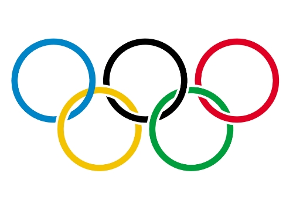

# projetDA

# Presentation :page_facing_up:

In this project, we will be analyzing the legacy of the Olympic Games from Athens 1896 till Rio 2016 In this dataset, we will jump into the participation of several athletes and their nations in every 
tournament from all the Olympic events 

 * which year and city did the Netherlands win the highest number of medals in their history.
 * visualizing the relationship between the number of athletes countries send to an event and the number of medals they receive.
 * In which sports does the height of an athlete increase their chances of earning a medal? 

## :file_folder: Dataset
 
 This dataset contains information about each athlete and his country 

 |id |name                    |sex|age|height|weight|team          |noc|games      |year|season|city       |sport        |event                             |medal|
|---|------------------------|---|---|------|------|--------------|---|-----------|----|------|-----------|-------------|----------------------------------|-----|
|1  |A Dijiang               |M  |24 |180   |80    |China         |CHN|1992 Summer|1992|Summer|Barcelona  |Basketball   |Basketball Men's Basketball       |NA   |
|2  |A Lamusi                |M  |23 |170   |60    |China         |CHN|2012 Summer|2012|Summer|London     |Judo         |Judo Men's Extra-Lightweight      |NA   |
|3  |Gunnar Nielsen Aaby     |M  |24 |NA    |NA    |Denmark       |DEN|1920 Summer|1920|Summer|Antwerpen  |Football     |Football Men's Football           |NA   |
|4  |Edgar Lindenau Aabye    |M  |34 |NA    |NA    |Denmark/Sweden|DEN|1900 Summer|1900|Summer|Paris      |Tug-Of-War   |Tug-Of-War Men's Tug-Of-War       |Gold |
|5  |Christine Jacoba Aaftink|F  |21 |185   |82    |Netherlands   |NED|1988 Winter|1988|Winter|Calgary    |Speed Skating|Speed Skating Women's 500 metres  |NA   |
|5  |Christine Jacoba Aaftink|F  |21 |185   |82    |Netherlands   |NED|1988 Winter|1988|Winter|Calgary    |Speed Skating|Speed Skating Women's 1,000 metres|NA   |
|5  |Christine Jacoba Aaftink|F  |25 |185   |82    |Netherlands   |NED|1992 Winter|1992|Winter|Albertville|Speed Skating|Speed Skating Women's 500 metres  |NA   |